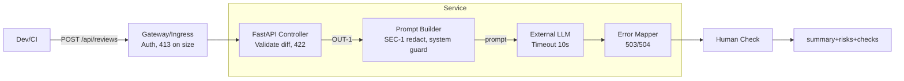

# ADR: решение для первого рабочего сценария

- Статус: accepted
- Дата: 2026-09-04
- Ответственные: SDLC архитектор (человек), Team Lead (человек), AI-помощник (опорная роль)

## Контекст

Учебный сервис FastAPI принимает POST `/api/reviews` с `{"diff": string}` и пересылает дифф в LLM для автоматического ревью. По TRAINING_PR.diff выявлены дефекты: отсутствие валидации/аутентификации, лимитов размера, обработок ошибок и таймаутов, а также риск prompt injection. В CASE.md заданы правила SEC-1, API-1, REL-1, OUT-1, SCOPE-1, QA-1, OBS-1, которыми должен руководствоваться сервис.

## Решение

Для первого рабочего сценария вводим минимальные, но достаточные изменения архитектуры и контрактов без изменения кода (в рамках этой практики формализуем поведение и проверяем через тесты):

- Контракт API: валидация тела запроса и обязательность поля `diff`; при отсутствии/пустоте — 422 Unprocessable Entity.
- Политика размера: дифф > 20 000 символов отклоняется с 413 Payload Too Large (API-1).
- Безопасность: эндпоинт защищается простым механизом auth (например, токен заголовка) на уровне шлюза/ингресса; запрос без авторизации → 401/403.
- Подготовка промпта: перед отправкой удаляем секреты/токены (SEC-1) и добавляем системные инструкции для снижения prompt injection.
- Надёжность: таймаут вызова LLM 10 секунд; исключения маппим в контролируемые 503/504 (REL-1).
- Выход: JSON c полями `summary`, `risks` (макс 3) и `checks` (OUT-1); соблюдение QA-1 и OBS-1.

Эти правила реализуются как требования и тесты; внедрение — итеративно, с наблюдаемыми метриками.

## Рассмотренные альтернативы

| Альтернатива | Почему не выбрали сейчас |
|---|---|
| Полная переработка в async и очереди | Выходит за рамки практики; не требуется для первого сценария |
| Встраивание стороннего WAF/Rate Limiter | Запрещено добавление зависимостей; покрываем через лимит размера и auth на периметре |
| Полный контент-фильтр диффа | Дорого без зависимости; SEC-1 достаточно для MVP |

## Последствия и главный риск

- Положительные последствия: предсказуемые ответы (4xx/5xx), снижение рисков DoS, управляемые ошибки LLM, понятный контракт ответа.
- Ограничения: без новых зависимостей; часть функций реализуется на уровне окружения (ingress auth), что требует настройки платформы.
- Главный риск: ложнонегативная фильтрация секретов или обход prompt injection при сложных атаках.
- Как проверим риск: тест с искусственными секретами → ожидаем [REDACTED]; инъекционный diff → LLM игнорирует инструкции пользователя, соблюдая системные правила; наблюдаем долю 5xx и P95 времени.

## Архитектурная схема

## Как использовали AI

- Для чего: консолидация требований первого сценария, формирование архитектурного решения и согласование с CASE.md.
- Тип промпта: master prompt.
- Строка в [`prompts.md`](prompts.md): P1-03 (см. prompt_03.txt).
- Что проверили и исправили сами: согласовали форматы, статусы, поля ответа; соотнесли с SEC-1..OBS-1; не меняли входные файлы.
