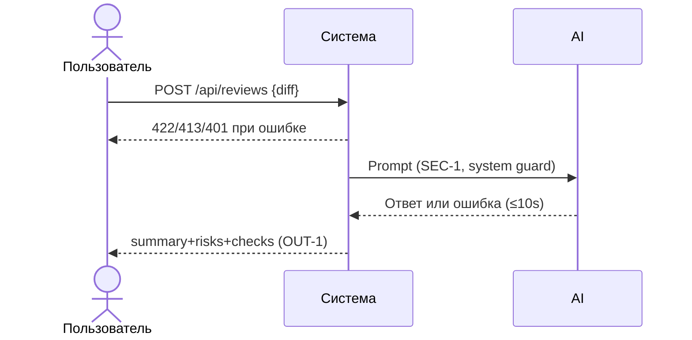

# Use cases и user stories

## Первый рабочий сценарий

**Когда** разработчик или CI отправляет в сервис POST `/api/reviews` с допустимым `diff` и авторизацией, **система** валидирует вход, редактирует секреты, формирует безопасный промпт, вызывает LLM с таймаутом и возвращает структурированный ответ `summary`, `risks`, `checks` (макс 3 риска), **а пользователь получает** проверяемый результат, пригодный для ручной проверки и принятия решения.

Не входит в этот сценарий:

- автоматическое принятие решений (approve/merge);
- изменение кода или комментариев в репозитории;
- добавление внешних зависимостей.

## Use case

| Поле | Значение |
|---|---|
| Актор | Разработчик или CI/CD |
| Триггер | Появился diff PR, требуется автоматический анализ |
| Предусловия | Авторизация валидна; размер `diff` ≤ 20 000 символов |
| Основной результат | Возвращён `summary`, `risks` (≤3), `checks` с привязкой к diff |
| Ошибка или отказ | 422 при невалидном входе; 413 при превышении лимита; 401/403 без авторизации; 503/504 при таймауте LLM |



## User stories и acceptance criteria

```gherkin
Feature: Автоматическое ревью diff

  Scenario: Успешный анализ допустимого diff
    Given авторизованный клиент имеет diff длиной 1000 символов
    When он отправляет POST /api/reviews с этим diff
    Then система возвращает 200 с полями summary, risks (не более 3), checks
    And риски ссылаются на строки diff и соответствуют QA-1

  Scenario: Невалидный ввод без diff
    Given авторизованный клиент отправляет пустое тело {}
    When вызывается POST /api/reviews
    Then система возвращает 422 Unprocessable Entity

  Scenario: Превышение лимита размера
    Given авторизованный клиент имеет diff длиной 25000 символов
    When он отправляет POST /api/reviews
    Then система возвращает 413 Payload Too Large

  Scenario: Нет авторизации
    Given неавторизованный клиент отправляет допустимый diff
    When вызывается POST /api/reviews
    Then система возвращает 401 или 403

  Scenario: Таймаут LLM
    Given LLM не отвечает в течение 10 секунд
    When система вызывает LLM
    Then система возвращает 504 Gateway Timeout или 503 Service Unavailable с диагностикой
```

## Как использовали AI

- Для чего: формулировка первого рабочего сценария, use case, и acceptance критериев.
- Тип промпта: master prompt.
- Строка в [`prompts.md`](prompts.md): P1-03 (см. prompt_03.txt).
- Что проверили и исправили сами: согласовали статусы и поля с CASE.md; ограничили риски до 3; не включали действия вне SCOPE-1.
