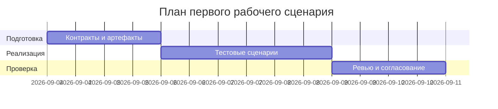

# План поставки

Файл ведёт OpenCode. Обсудите с агентом содержание и проверьте предложенный diff. Все дополнения и исправления поручайте агенту в чате.

## Инкременты и ответственность

| Инкремент | Наблюдаемый результат | Что делает человек | Что делает AI или субагент | Проверка | Зависимости |
|---|---|---|---|---|---|
| 1 | Описаны контракты API/статусы; обновлены артефакты | SDLC архитектор формализует правила CASE.md в артефактах | AI генерирует черновики схем и сценариев | Peer review по артефактам; ссылки P1-03 | CASE.md |
| 2 | Тесты unit/integration/e2e описаны | QA/Dev уточняют граничные случаи | AI помогает оформить Gherkin/mermaid | Прогон тестов (концептуально) | Инкремент 1 |
| 3 | Нагрузочные сценарии и метрики согласованы | Team Lead утверждает лимиты и P95 | AI предлагает профиль нагрузки | Проверка: сценарии 413/P95 < 1s | Инкременты 1–2 |

## Диаграмма Ганта

Передайте OpenCode даты и задачи своего плана и попросите обновить диаграмму.

## Как использовали AI

- Для чего: ускорение подготовки артефактов, формулировок тестов и визуализаций.
- Тип промпта: master prompt.
- Строка в [`prompts.md`](prompts.md): P1-03 (см. prompt_03.txt).
- Что проверили и исправили сами: роли и зависимости; реалистичность сроков; согласование с SEC-1..OBS-1.
